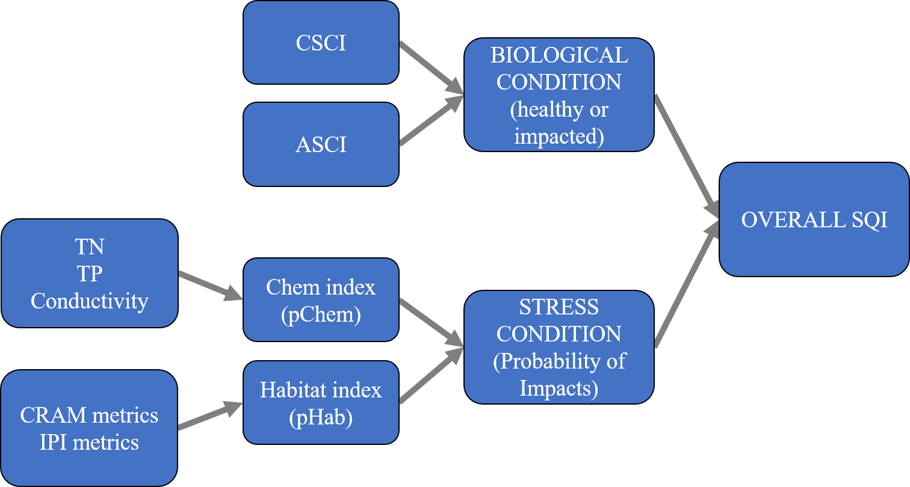
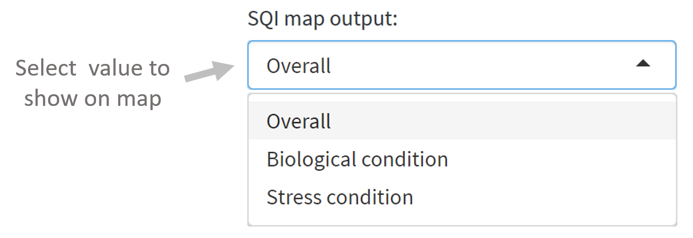

```{r global, include = FALSE, message = F, warning = F}
knitr::opts_chunk$set(echo = TRUE, warning = F, message = F, echo = F)

# packages
library(shiny)
library(tidyverse)
library(randomForest)
library(patchwork)
library(flexdashboard)
library(SQI)
# devtools::load_all('../SQI/.')
library(mapview)
library(leaflet)
library(sf)
library(shinyWidgets)

# source functions and data
source("R/funcs.R")
data(alldatavg)
data(sheds)
data(cntys)

# numeric variable names
numnms <- c('CSCI', 'ASCI', 'TN2', 'TP', 'Cond', 'indexscore_cram', 'PCT_SAFN', 'H_AqHab', 'H_SubNat',  'Ev_FlowHab', 'XCMG')
numlab <- c('CSCI', 'ASCI', 'Total nitrogen', 'Total phosphorus', 'Conductivity', 'CRAM index score', '% sands and fines', 'Diversity of habitat', 'Diversity of substrate', 'Evenness of flow habitat', 'Riparian veg. cover')
names(numnms) <- numlab

# color lims
cscilim <- c(0, 0.79, 1, 1.5)
ascilim <- c(0, 33, 66, 100)
tnlim <- c(34, 22, 11, 0)
tplim <- c(4, 3, 1.5, 0)
condlim <- c(7050, 4700, 2350, 0)
cramlim <- c(0, 33, 66, 100)
safnlim <- c(100, 66, 33, 0)
aqhablim <- c(0, 0.87, 1.74, 2.6)
subnatlim <- c(0, 0.87, 1.74, 2.6)
flowhablim <- c(0, 0.33, 0.66, 1)
veglim <- c(0, 100, 200, 300)

# for boxplot color limits
collims <- list(cscilim, ascilim, tnlim, tplim, condlim, cramlim, safnlim, aqhablim, subnatlim, flowhablim, veglim)
names(collims) <- numlab
collims <- enframe(collims, 'var', 'lims')

# color palette function for boxplots
pal_exp <- colorFactor(
  palette = c('#ff0000', '#f9c802', '#a9d70b'),
  na.color = 'yellow',
  levels = c('lo', 'md', 'hi'))

```

```{r reactives}
# selected site for results
cats <- reactive({

  req(nrow(sitedat()) > 0)
  
  # inputs
  sitedat <- sitedat()
  
  # subset
  out <- sitedat %>% 
    filter(MasterID %in% selsit)
  
  return(out)
  
  })

# choices for spatial filter
spaflt <- reactive({
  
  # input
  flby <- input$flby
  
  if(flby == 'SMC watersheds')
    out <- sheds %>% 
      rename(polylab = SMC_Name)
          
  if(flby == 'Counties')
    out <- cntys %>% 
      rename(polylab = cnty)
  
  out <- out %>% 
    pull(polylab) %>% 
    sort %>% 
    as.character
  
  return(out)
  
})

# selected shed or county polygons, filtered
polys <- reactive({
  
  # inputs
  flby <- input$flby
  flts <- input$flts
      
  if(flby == 'SMC watersheds')
    out <- sheds %>% 
      rename(pllb = SMC_Name)

  if(flby == 'Counties')
    out <- cntys %>% 
      rename(pllb = cnty)
  
  # filter by selection
  out <- out %>% 
    filter(pllb %in% flts)
  
  return(out)
  
})

# filter site data by spatial 
sitedat <- reactive({
  
  # input
  polys <- polys()
  
  out <- alldatavg[polys, ]
  
  return(out)
  
})

# distribution of conditions for selected sites given spatial filter
dstdat <- reactive({
  
  # input
  sitedat <- sitedat()

  # aggregate 
  out <- sitedat
  st_geometry(out) <- NULL
  out <- out %>% 
    select_if(is.numeric) %>% 
    gather('var', 'val') %>% 
    filter(var %in% numnms) %>% 
    mutate(
      var = factor(var, levels = numnms, labels = names(numnms))
    )
  
  return(out)
  
})

# selected site data but in long format
catslng <- reactive({
  
  # input
  cats <- cats()
  
  # format selected data
  st_geometry(cats) <- NULL
  out <- cats %>% 
    select_if(is.numeric) %>% 
    gather('var', 'val') %>% 
    filter(var %in% numnms) %>% 
    mutate(
      var = factor(var, levels = numnms, labels = names(numnms))
    )
  
  return(out)
  
})

# distribution boxplots, biology
dstbio <- reactive({
  
  # only do it a site has been selected
  req(nrow(catslng()) > 0)
  
  # input
  dstdat <- dstdat()
  catslng <- catslng()
  
  # filters
  selvr <- numlab[c(1:2)]
  
  # get boxplots
  out <- dst_fun(catslng, dstdat, selvr, collims, pal_exp)
  
  return(out)
  
})

# distribution boxplots, chemistry
dstchm <- reactive({
  
  # only do it a site has been selected
  req(nrow(catslng()) > 0)
  
  # input
  dstdat <- dstdat()
  catslng <- catslng()
  
  # filters
  selvr <- numlab[c(3:5)]
  
  # get boxplots
  out <- dst_fun(catslng, dstdat, selvr, collims, pal_exp)
  
  return(out)
  
})

# distribution boxplots, habitat
dsthab <- reactive({
  
  # only do it a site has been selected
  req(nrow(catslng()) > 0)
  
  # input
  dstdat <- dstdat()
  catslng <- catslng()
  
  # filters
  selvr <- numlab[c(6:11)]
  
  # get boxplots
  out <- dst_fun(catslng, dstdat, selvr, collims, pal_exp)
  
  return(out)
  
})

```

```{r outputobj}
output$map <- renderLeaflet({

  # input
  tomap <- input$tomap
  polys <- polys()
  sitedat <- sitedat()
  
  req(nrow(polys) > 0)
  
  # assign colors
  cols <- getdsccol(sitedat[[tomap]])
  names(cols) <- NULL
  names(sitedat)[names(sitedat) %in% tomap] <- 'toshw'
  
  # legend stuff
  legcols <- getdsccol(palfac = tomap)

  mapview(polys, fill = F, label = polys$pllb, homebutton = F, popup = NULL) %>% 
    .@map %>% 
    removeMouseCoordinates() %>%
    addCircleMarkers(
      data = sitedat, 
      layerId = ~MasterID,
      stroke = TRUE,
      color = 'black',
      fill = TRUE,
      fillColor = cols,
      radius=5, 
      weight = 1,
      fillOpacity = 1,
      label = ~paste0(MasterID, ': ', toshw)
    ) %>% 
    addLegend("bottomleft", colors = legcols$col, labels = legcols$nms, opacity = 1)

})

# leaflet proxy for marker select
map <- leafletProxy("map")

# binding for marker select
makeReactiveBinding('selsit')

# the selection
observeEvent(input$map_marker_click, {
  selsit <<- input$map_marker_click$id
})

observeEvent(input$map_marker_click, {

  # inputs
  tomap <- input$tomap
  sitedat <- sitedat()
  
  # colors
  cols <- getdsccol(sitedat[[tomap]])
  names(cols) <- NULL
  names(sitedat)[names(sitedat) %in% tomap] <- 'toshw'
  
  # filter the pour points by selection
  selsitplo <- sitedat %>% 
    filter(MasterID %in% selsit)
  selsitplocol <- getdsccol(selsitplo[['toshw']])
  names(selsitplocol) <- NULL
  
  # clear markers on input select, add all points and selected point
  map <- map %>% 
    clearMarkers() %>% 
    addCircleMarkers(
      data = sitedat, 
      layerId = ~MasterID,
      stroke = TRUE,
      color = 'black',
      fill = TRUE,
      fillColor = cols,
      radius=5, 
      weight = 1,
      fillOpacity = 1,
      label = ~paste0(MasterID, ': ', toshw)
    ) %>% 
    addCircleMarkers(
      data = selsitplo, 
      layerId = ~MasterID,
      stroke = TRUE,
      color = 'black',
      fillColor = selsitplocol,
      fill = TRUE,
      radius=10, 
      weight = 6,
      fillOpacity = 1,
      label = ~paste0(MasterID, ': ', toshw)
    )
      
})

##
# SQI descriptor outputs
output$overall <- flexdashboard::renderValueBox({
  req(nrow(cats()) > 0)
  txtin <- cats()$StreamHealthIndex
  colin <- getdsccol(txtin)
  flexdashboard::valueBox(tags$p(txtin, style = "font-size: 70%"), icon = 'glyphicon-plus', color = colin)
  })
output$biolcon <- flexdashboard::renderValueBox({
  req(nrow(cats()) > 0)
  txtin <- cats()$BiologicalCondition
  colin <- getdsccol(txtin)
  flexdashboard::valueBox(tags$p(txtin, style = "font-size: 70%"), icon = 'glyphicon-leaf', color = colin)
  })
output$strscon <- flexdashboard::renderValueBox({
  req(nrow(cats()) > 0)
  txtin <- cats()$OverallStressCondition
  colin <- getdsccol(txtin)
  flexdashboard::valueBox(tags$p(txtin, style = "font-size: 70%"), icon = 'glyphicon-flash', color = colin)
  })
output$strsdet <- flexdashboard::renderValueBox({
  req(nrow(cats()) > 0)
  txtin <- cats()$OverallStressCondition_detail
  colin <- getdsccol(txtin)
  flexdashboard::valueBox(tags$p(txtin, style = "font-size: 70%"), icon = 'glyphicon-flash', color = colin)
  })

##
# probability gauge outputs
output$pchemhab <- renderGauge({
  
    val <- round(100 * cats()$pChemHab, 1)
    gauge(val, min = 0, max = 100, symbol = '%', gaugeSectors(
     success = c(0, 33), warning = c(33, 66), danger = c(66, 100)
    ))
             
  })
output$pchem <- renderGauge({
  
  val <- round(100 * cats()$pChem, 1)
  gauge(val, min = 0, max = 100, symbol = '%', gaugeSectors(
     success = c(0, 33), warning = c(33, 66), danger = c(66, 100)
  ))
  
})
output$phab <- renderGauge({
  val <- round(100 * cats()$pHab, 1)
  gauge(val, min = 0, max = 100, symbol = '%', gaugeSectors(
     success = c(0, 33), warning = c(33, 66), danger = c(66, 100)
  ))
  
})

##
# detail gauge outputs
output$csci <- renderGauge({
  val <- round(cats()$CSCI, 2)
  gauge(val, min = cscilim[1], max = cscilim[4], gaugeSectors(
     danger = cscilim[c(1, 2)], warning = cscilim[c(2, 3)], success = cscilim[c(3, 4)])
  )
})
output$asci <- renderGauge({
  val <- round(cats()$ASCI, 1)
  gauge(val, min = ascilim[1], max = ascilim[4], gaugeSectors(
     danger = ascilim[c(1, 2)], warning = ascilim[c(2, 3)], success = ascilim[c(3, 4)])
  )
})
output$tn <- renderGauge({
  val <- round(cats()$TN2, 1)
  gauge(val, min = tnlim[4], max = tnlim[1], gaugeSectors(
     danger = tnlim[c(3, 4)], warning = tnlim[c(2, 3)], success = tnlim[c(1, 2)])
  )
})
output$tp <- renderGauge({
  val <- round(cats()$TP, 1)
  gauge(val, min = tplim[4], max = tplim[1], gaugeSectors(
     danger = tplim[c(3, 4)], warning = tplim[c(2, 3)], success = tplim[c(1, 2)])
  )
})
output$cond <- renderGauge({
  val <- round(cats()$Cond, 1)
  gauge(val, min = condlim[4], max = condlim[1], gaugeSectors(
     danger = condlim[c(3, 4)], warning = condlim[c(2, 3)], success = condlim[c(1, 2)])
  )
})
output$cram <- renderGauge({
  val <- round(cats()$indexscore_cram, 1)
  gauge(val, min = cramlim[1], max = cramlim[4], gaugeSectors(
     danger = cramlim[c(1, 2)], warning = cramlim[c(2, 3)], success = cramlim[c(3, 4)])
  )
})
output$safn <- renderGauge({
  val <- round(cats()$PCT_SAFN, 1)
  gauge(val, min = safnlim[4], max = safnlim[1], gaugeSectors(
     danger = safnlim[c(3, 4)], warning = safnlim[c(2, 3)], success = safnlim[c(1, 2)])
  )
})
output$aqhab <- renderGauge({
  val <- round(cats()$H_AqHab, 1)
  gauge(val, min = aqhablim[1], max = aqhablim[4], gaugeSectors(
     danger = aqhablim[c(1, 2)], warning = aqhablim[c(2, 3)], success = aqhablim[c(3, 4)])
  )
})
output$subnat <- renderGauge({
  val <- round(cats()$H_SubNat, 1)
  gauge(val, min = subnatlim[1], max = subnatlim[4], gaugeSectors(
     danger = subnatlim[c(1, 2)], warning = subnatlim[c(2, 3)], success = subnatlim[c(3, 4)])
  )
})
output$flowhab <- renderGauge({
  val <- round(cats()$Ev_FlowHab, 1)
  gauge(val, min = flowhablim[1], max = flowhablim[4], gaugeSectors(
     danger = flowhablim[c(1, 2)], warning = flowhablim[c(2, 3)], success = flowhablim[c(3, 4)])
  )
})
output$veg <- renderGauge({
  val <- round(cats()$XCMG, 1)
  gauge(val, min = veglim[1], max = veglim[4], gaugeSectors(
     danger = veglim[c(1, 2)], warning = veglim[c(2, 3)], success = veglim[c(3, 4)])
  )
})

##
# plots 

# distribution boxplots, biology
output$plodstbio <- renderPlot({
  
  # input
  dstplo <- dstbio()

  # patchwork
  wrap_plots(dstplo$plos, nrow = 1)
  
})

# distribution boxplots, chemistry
output$plodstchm <- renderPlot({
  
  # input
  dstplo <- dstchm()

  # patchwork
  wrap_plots(dstplo$plos, nrow = 1)
  
})

# distribution boxplots, habitat
output$plodsthab <- renderPlot({
  
  # input
  dstplo <- dsthab()

  # patchwork
  wrap_plots(dstplo$plos, nrow = 1)
  
})
```

Sidebar {.sidebar data-width=700}
===========================================================

```{r}
# select spatial filter
column(width = 12, 
  
  column(width = 6, 
         
    selectInput('flby', 'Filter by:', choices = c('SMC watersheds', 'Counties'))
                
  ), 
  
  column(width = 6, 
         
    renderUI({
      
      # input
      spaflt <- spaflt()

      pickerInput(inputId = "flts", label = 'Select spatial filters:', choices = spaflt,
        options = list(`actions-box` = TRUE, size = 20), selected = spaflt, multiple = TRUE)      
      
    })
           
  )
       
)

# select index output on map and site selection text
column(width = 12, 
       
  column(width = 6, 
                
    selectInput('tomap', 'SQI map output:', 
      choices = list(
        'Overall' = 'StreamHealthIndex', 
        'Biological condition' = 'BiologicalCondition',
        'Stress condition' = 'OverallStressCondition', 
        'Stress condition detail' = 'OverallStressCondition_detail'
      ), 
      selected = 'Overall'
    )
  
  ),
  
  column(width = 6, 
         
    renderText(paste0('Selected site: ', selsit))
    
  )
  
)
```

```{r}
leafletOutput('map', height = 580)
```

Overview
=====================================

Column {data-width=500}
------------------------------------------------------------------------

### Welcome to the Stream Quality Index (SQI) dashboard!

This interactive web page will allow you to explore SQI scores for stream sampling sites from the Stormwater Monitoring Coalition (SMC) Data Portal.  Start by selecting a site by clicking a location on the map to the left.  Scroll through the SQI **Scores**, score **Details**, and **Relative details** for the selected site using the menu selections on the top. 

#### SQI structure

The SQI combines biological, physical, and chemical data to provide an overall picture of stream quality.  

```{r, out.width = "75%", fig.align = 'center'}

```

Water chemistry (TN, TP, conductivity) and physical habitat (CRAM, PHAB metrics) provide information on in-stream stressors.   The CSCI (California Stream Condition Index) and ASCI (Algal Stream Condition Index) provide information on biological condition.  The stressor data are synthesized into a stressor index that describes the joint probability of stream condition being affected by chemistry or physical habitat stressors.  Similarly, the biological data are synthesized into an overall biological response index.  Together, the stressor and response indices proves the overall condition represented by the SQI.  

#### SQI scores

The SQI can describe stream quality relative to an overall score, the biological condition, the stress condition, and details about the stress condition.  This information for a selected site can be viewed on the **Scores** tab and for al sites on the map using the dropdown menu:

```{r, out.width = '35%', fig.align = 'center'}

```

The overall SQI score for a site (far right on the above figure) is based on the categorical combinations of biological (healthy, impacted) and stressor (unstressed, stressed) conditions.  Based on these combinations, a site is assigned one of four categorical scores shown below.  

```{r, out.width = "50%", fig.align = 'center'}
knitr::include_graphics("www/sqi_scen.PNG")
```

Individual components that are used to create the overall SQI score are also categorized.  The biological condition at a site is assigned to one of four categories shown below based on observed CSCI and ASCI scores. 

```{r, out.width = "50%", fig.align = 'center'}

```

The stress condition at a site is assigned one of three levels based on chemical and habitat conditions.

```{r, out.width = "60%", fig.align = 'center'}

```

Details about the stress condition are based on occurrence of chemical and habitat stressors.

```{r, out.width = "80%", fig.align = 'center'}
knitr::include_graphics("www/sqi_strdet.PNG")
```

The stress categories are based on a modelled probability of observing chemistry stressors, habitat stressors, none, both, or stress attributed to neither.  The probability of biology being impacted by different combinations of stressors can be viewed on the **Scores** tab.

Scores
=====================================

Column {data-width=500}
------------------------------------------------------------------------

### Overall

```{r}
flexdashboard::valueBoxOutput('overall')
```

### Biological condition

```{r}
flexdashboard::valueBoxOutput('biolcon')
```

### Stress condition

```{r}
flexdashboard::valueBoxOutput('strscon')
```

### Stress condition detail

```{r}
flexdashboard::valueBoxOutput('strsdet')
```

### Probability of stress

```{r}
 column(width = 12,
                  shinydashboard::box(gaugeOutput('pchemhab'), title = HTML('<h4><i>Prob. of overall stress:</i></h4>'), width = 4),
                  shinydashboard::box(gaugeOutput('pchem'), title = HTML('<h4><i>Prob. of chemistry stress:</i></h4>'), width = 4),
                  shinydashboard::box(gaugeOutput('phab'), title = HTML('<h4><i>Prob. of habitat stress:</i></h4>'), width = 4)
           )
```

Details
===================================== 

Column 
-----------------------------------------------------------------------

### Biology

```{r}
 column(width = 12,
                  shinydashboard::box(gaugeOutput('csci'), title = HTML('<h4><i>CSCI:</i></h4>'), width = 3),
                  shinydashboard::box(gaugeOutput('asci'), title = HTML('<h4><i>ASCI:</i></h4>'), width = 3)
 )
```

### Chemistry

```{r}
column(12, 
  shinydashboard::box(gaugeOutput('tn'), title = HTML('<h4><i>Total nitrogen:</i></h4>'), width = 3),
  shinydashboard::box(gaugeOutput('tp'), title = HTML('<h4><i>Total phosphorus:</i></h4>'), width = 3),
  shinydashboard::box(gaugeOutput('cond'), title = HTML('<h4><i>Conductivity:</i></h4>'), width = 3)
)
```

### Habitat

```{r}
 column(width = 12,
                  shinydashboard::box(gaugeOutput('cram', height = '500px'), title = HTML('<h4><i>CRAM index score:</i></h4>'), width = 2),
                  shinydashboard::box(gaugeOutput('safn', height = '500px'), title = HTML('<h4><i>% sands and fines:</i></h4>'), width = 2),
                  shinydashboard::box(gaugeOutput('aqhab', height = '500px'), title = HTML('<h4><i>Diversity of habitat:</i></h4>'), width = 2),
                  shinydashboard::box(gaugeOutput('subnat', height = '500px'), title = HTML('<h4><i>Diversity of substrate:</i></h4>'), width = 2),
                  shinydashboard::box(gaugeOutput('flowhab', height = '500px'), title = HTML('<h4><i>Evenness of flow habitat:</i></h4>'), width = 2),
                  shinydashboard::box(gaugeOutput('veg', height = '500px'), title = HTML('<h4><i>Riparian veg. cover:</i></h4>'), width = 2)
 )
```

Relative details
===================================== 

Column 
-----------------------------------------------------------------------

### Biology

```{r}
plotOutput('plodstbio')
```

### Chemistry

```{r}
plotOutput('plodstchm')
```

### Habitat

```{r}
plotOutput('plodsthab')
```
